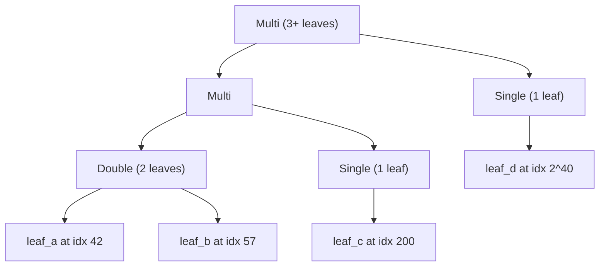

# Compressed Sparse Merkle Tree

## Problem Summary

The current `SparseMerkleTree` in [smt/src/smt.rs](smt/src/smt.rs) stores every internal node in a `BTreeMap<u64, F>`. For 51.7M leaves at height 53, this creates ~1.4 billion entries consuming ~80-90 GB of RAM. The machine swaps to disk, making construction take 10+ hours.

## Core Idea: Compressed Node Types

Instead of materializing every internal node, classify each subtree by how many non-default leaves it contains:




- **Zero**: 0 leaves in subtree. Hash = `empty_hashes[level]` (precomputed, O(1)).
- **Single**: exactly 1 leaf. Stores `(leaf_index, leaf_value)`. Hash computed on demand by walking the leaf up through empty siblings.
- **Double**: exactly 2 leaves. Stores both `(index, value)` pairs. Hash computed on demand by finding their divergence point and merging two Single paths.
- **Multi**: 3+ leaves. Stores the computed hash and `Box` pointers to left/right children. This is the only variant that recurses into child nodes.

## Memory Analysis (51.7M leaves, N=53)

Leaves are ~0.0006% dense in the 2^53 address space. Collisions between leaves begin around level ~27 (from the leaf level). Below that, almost every subtree with a leaf is a Single node.

- Total compressed nodes: ~2 * 51.7M = ~103M (each Multi node has 2 children; Single/Double/Zero are leaf nodes of the compressed tree)
- Average node size: ~56 bytes (Zero: 8B, Single: 48B, Double: 88B, Multi: 56B)
- **Total memory: ~6 GB** (vs ~80-90 GB with BTreeMap)

## Hash Count Analysis

The total Poseidon hash count is fundamentally ~1.5 billion regardless of data structure (each occupied internal node in the original tree needs one hash). The compressed tree does NOT reduce the total hash count -- the win is purely that everything fits in RAM, eliminating swap thrashing.

With rayon parallelism, the ~1.5B hashes can be distributed across cores:


| Cores | Estimated time (at 28us/hash) |
| ----- | ----------------------------- |
| 1     | ~11 hours                     |
| 8     | ~1.4 hours                    |
| 16    | ~42 minutes                   |
| 32    | ~21 minutes                   |


## New File: `smt/src/compressed_smt.rs`

### Data Structures

```rust
/// Compressed node in the sparse Merkle tree.
enum CompressedNode<F: PrimeField> {
    /// Subtree has zero non-default leaves.
    Zero,

    /// Subtree has exactly one non-default leaf.
    /// Hash = leaf hashed up through L empty siblings (computed during build).
    Single {
        leaf_index: u64,
        leaf_value: F,
        hash: F,
    },

    /// Subtree has exactly two non-default leaves.
    /// Hash = merge of two Single paths at their divergence point (computed during build).
    Double {
        leaf_a: (u64, F), // (index, value)
        leaf_b: (u64, F),
        hash: F,
    },

    /// Subtree has 3+ non-default leaves.
    /// Hash = poseidon(left.hash, right.hash), stored.
    Multi {
        hash: F,
        left: Box<CompressedNode<F>>,
        right: Box<CompressedNode<F>>,
    },
}

/// Compressed Sparse Merkle Tree.
pub struct CompressedSMT<
    F: PrimeField + FromUniformBytes<64>,
    H: FieldHasher<F, 2>,
    const N: usize,
> {
    root: CompressedNode<F>,
    empty_hashes: [F; N],
    marker: PhantomData<H>,
}
```

### Construction Algorithm (top-down recursive with rayon)

```rust
fn build(
    leaves: &[(u64, F)],   // sorted by index
    level: usize,           // current subtree height (N at root, 0 at leaves)
    hasher: &H,
    empty_hashes: &[F; N],
) -> CompressedNode<F> {
    match leaves.len() {
        0 => CompressedNode::Zero,
        1 => {
            let hash = compute_single_hash(leaves[0], level, hasher, empty_hashes);
            CompressedNode::Single { leaf_index: leaves[0].0, leaf_value: leaves[0].1, hash }
        }
        2 => {
            let hash = compute_double_hash(leaves[0], leaves[1], level, hasher, empty_hashes);
            CompressedNode::Double { leaf_a: leaves[0], leaf_b: leaves[1], hash }
        }
        _ => {
            // Split by bit (level - 1) of leaf index
            let split = leaves.partition_point(|(idx, _)| (*idx >> (level - 1)) & 1 == 0);
            let (left_leaves, right_leaves) = leaves.split_at(split);

            // Parallel recursion for large subtrees
            let (left, right) = if leaves.len() > PARALLEL_THRESHOLD {
                rayon::join(
                    || build(left_leaves, level - 1, hasher, empty_hashes),
                    || build(right_leaves, level - 1, hasher, empty_hashes),
                )
            } else {
                (
                    build(left_leaves, level - 1, hasher, empty_hashes),
                    build(right_leaves, level - 1, hasher, empty_hashes),
                )
            };

            let hash = hasher.hash([left.hash(level-1, empty_hashes),
                                     right.hash(level-1, empty_hashes)]).unwrap();
            CompressedNode::Multi { hash, left: Box::new(left), right: Box::new(right) }
        }
    }
}
```

### Hash Helpers

**Single hash** -- hash one leaf up through `level` layers of empty siblings:

```rust
fn compute_single_hash(
    (leaf_index, leaf_value): (u64, F),
    level: usize,
    hasher: &H,
    empty_hashes: &[F],
) -> F {
    let mut h = leaf_value;
    for l in 0..level {
        let bit = (leaf_index >> l) & 1;
        h = if bit == 0 {
            hasher.hash([h, empty_hashes[l]]).unwrap()
        } else {
            hasher.hash([empty_hashes[l], h]).unwrap()
        };
    }
    h
}
```

**Double hash** -- find divergence level, merge two Single paths:

```rust
fn compute_double_hash(
    a: (u64, F), b: (u64, F),
    level: usize, hasher: &H, empty_hashes: &[F],
) -> F {
    let xor = a.0 ^ b.0;
    let div_level = 64 - xor.leading_zeros() as usize; // highest differing bit + 1

    // Hash each leaf up to (div_level - 1) levels
    let a_hash = compute_single_hash(a, div_level - 1, hasher, empty_hashes);
    let b_hash = compute_single_hash(b, div_level - 1, hasher, empty_hashes);

    // Merge at divergence level
    let a_bit = (a.0 >> (div_level - 1)) & 1;
    let (left, right) = if a_bit == 0 { (a_hash, b_hash) } else { (b_hash, a_hash) };
    let mut h = hasher.hash([left, right]).unwrap();

    // Continue up from div_level to the node's level
    for l in div_level..level {
        let bit = (a.0 >> l) & 1; // a and b agree above divergence
        h = if bit == 0 {
            hasher.hash([h, empty_hashes[l]]).unwrap()
        } else {
            hasher.hash([empty_hashes[l], h]).unwrap()
        };
    }
    h
}
```

### Proof Generation

Walk the compressed tree from root to the target leaf, collecting sibling hashes. The key insight: for Zero/Single/Double siblings, the hash is already precomputed and stored in the node.

**Sparse proof** (returns `SparsePath<F, H>` -- compatible with existing `SparsePathChip`):

```rust
fn collect_sparse_proof(
    node: &CompressedNode<F>,
    target_index: u64,
    level: usize,          // height of this node
    empty_hashes: &[F],
    entries: &mut Vec<SparsePathEntry<F>>,
) {
    match node {
        Zero => panic!("leaf not in tree"),
        Single { leaf_index, .. } => {
            assert_eq!(*leaf_index, target_index);
            // No siblings from within a Single subtree
        }
        Double { leaf_a, leaf_b, .. } => {
            // Identify target and other leaf
            let (_, other) = if leaf_a.0 == target_index {
                (leaf_a, leaf_b)
            } else {
                (leaf_b, leaf_a)
            };
            // The other leaf appears as a Single-hash sibling at (div_level - 1)
            let div_level = 64 - (target_index ^ other.0).leading_zeros() as usize;
            let sibling_hash = compute_single_hash(*other, div_level - 1, hasher, empty_hashes);
            let target_bit = (target_index >> (div_level - 1)) & 1;
            entries.push(SparsePathEntry {
                sibling: sibling_hash,
                direction_bit: target_bit == 1,
                level: div_level - 1,
            });
        }
        Multi { left, right, .. } => {
            let bit = (target_index >> (level - 1)) & 1;
            let (target_child, sibling_child) = if bit == 0 {
                (left.as_ref(), right.as_ref())
            } else {
                (right.as_ref(), left.as_ref())
            };
            // Recurse into the target child
            collect_sparse_proof(target_child, target_index, level - 1, empty_hashes, entries);
            // Add sibling if non-empty
            let sibling_hash = sibling_child.hash();
            if sibling_hash != empty_hashes[level - 1] {
                entries.push(SparsePathEntry {
                    sibling: sibling_hash,
                    direction_bit: bit == 1,
                    level: level - 1,
                });
            }
        }
    }
}
```

The entries are then sorted by level (leaf-to-root order) to match the `SparsePath` contract. A dense `Path<F, H, N>` can also be generated by filling all N levels (using `empty_hashes` for gaps).

### Public API

```rust
impl<F, H, const N: usize> CompressedSMT<F, H, N> {
    /// Build from sorted leaves. Accepts u64 indices for full 2^N address space.
    pub fn new(leaves: &BTreeMap<u64, F>, hasher: &H, empty_leaf: &[u8; 64]) -> Result<Self>;

    /// Convenience: build from sequential u32-indexed leaves (compat with old API).
    pub fn new_from_u32(leaves: &BTreeMap<u32, F>, hasher: &H, empty_leaf: &[u8; 64]) -> Result<Self>;

    /// Root hash.
    pub fn root(&self) -> F;

    /// Dense membership proof (all N levels). Compatible with PathChip.
    pub fn generate_membership_proof(&self, index: u64) -> Path<F, H, N>;

    /// Sparse membership proof (K << N levels). Compatible with SparsePathChip.
    pub fn generate_sparse_membership_proof(&self, index: u64) -> SparsePath<F, H>;
}
```

## Changes to Existing Files

- [smt/src/lib.rs](smt/src/lib.rs): Add `pub mod compressed_smt;`
- [smt/Cargo.toml](smt/Cargo.toml): Add `rayon = "1"` dependency
- No changes to [chiplet/](chiplet/) -- the compressed SMT produces the same `Path` and `SparsePath` types that the circuit chips already consume.

## Testing Strategy

1. **Correctness**: For small trees (height 3-10), verify that `CompressedSMT` and `SparseMerkleTree` produce identical roots and identical proofs for every leaf.
2. **Node classification**: Verify Zero/Single/Double/Multi classification for hand-crafted inputs (e.g., 0 leaves = Zero, 1 leaf = Single, 2 leaves with known divergence = Double, 3+ leaves = Multi).
3. **Circuit compatibility**: Feed `CompressedSMT`-generated proofs into existing `SparsePathChip` and `PathChip` test circuits and verify they pass.
4. **Scale test**: Build a tree with ~1M leaves at height 53 and verify root + sample proofs (without exhaustive proof generation).

## Future Work (not in initial implementation)

- **Incremental updates**: `insert()` / `update()` on the compressed tree (requires re-classifying affected subtrees)
- **Serialization**: Save/load the compressed tree to disk for reuse
- **Batch proof generation**: Parallelize proof generation across multiple leaves

