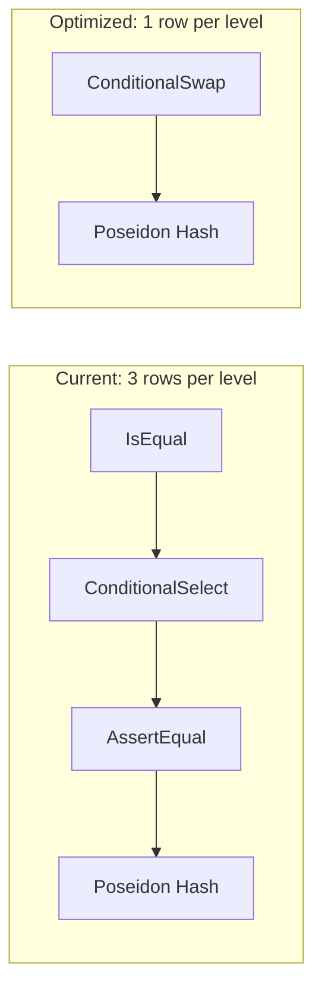

# Direction Bit Optimization for SMT Circuit

## Problem

Each level in `calculate_root` currently uses three utility gadgets (3 rows):

```
IsEqual(prev, left)       → 1 row   (compute which side prev is on)
ConditionalSelect(...)    → 1 row   (select the matching side)
AssertEqual(prev, result) → 1 row   (verify selection)
Poseidon hash(left,right) → ~64 rows (dominant cost)
```

The first three are redundant if the prover supplies a **direction bit** indicating which side of the tree the path descends on each level. This is already known during proof generation.

## Design

Replace the three-gadget pattern with a single **ConditionalSwap** gate that, given `(prev_hash, sibling, direction_bit)`, outputs the correctly ordered hash inputs in 1 row:

- `bit = 0` (left child): `hash(prev, sibling)`
- `bit = 1` (right child): `hash(sibling, prev)`




## File Changes

### 1. `smt/src/smt.rs` -- Add direction bits to Path

- Add `pub direction_bits: [bool; N]` field to `Path` struct (line 74)
- Populate in `generate_membership_proof` (line 249): `direction_bits[level] = !is_left_child(current_node)`
- Initialize in `Path` construction (line 258)
- Native `calculate_root` / `check_membership` / `get_index` remain unchanged (they still use the `(left, right)` pairs)

### 2. `chiplet/src/utilities.rs` -- New ConditionalSwapChip

Add a new `ConditionalSwapChip` alongside the existing utility chips. The gate uses 5 advice columns in a single row:

```rust
// advices: [a, b, bit, out_a, out_b]
// Constraints:
//   bit * (1 - bit) = 0                              (boolean)
//   out_a = (1 - bit) * a + bit * b                  (first output)
//   out_b = bit * a + (1 - bit) * b                  (second output)
```

Method signature:

```rust
pub fn swap(&self, layouter, a, b, bit) -> Result<(AssignedCell, AssignedCell), Error>
```

When `bit = 0`: outputs `(a, b)` (no swap). When `bit = 1`: outputs `(b, a)` (swapped).

### 3. `chiplet/src/smt_chip.rs` -- Rewire PathConfig and PathChip

**PathConfig** changes:

- Remove `conditional_select_config` and `assert_equal_config`
- Add `swap_config: ConditionalSwapConfig<F>`
- Keep `is_eq_config` (still needed by `check_membership` for final root comparison)
- Keep `poseidon_config`

**PathChip** struct changes:

- Replace `path: [(AssignedCell, AssignedCell); N]` with:
  - `siblings: [AssignedCell<F, F>; N]`
  - `direction_bits: [AssignedCell<F, F>; N]`
- Remove `conditional_select_chip` and `assert_equal_chip`
- Add `swap_chip: ConditionalSwapChip<F>`
- Keep `is_eq_chip` and `poseidon_chip`

`**configure**`: Allocate 5 advice columns for the swap gate instead of 4 utility columns shared between three chips. Remove configuration of ConditionalSelect and AssertEqual.

`**from_native**`: Extract siblings and direction bits from the native `Path`:

```rust
let sibling = if native.direction_bits[i] {
    native.path[i].0  // we're right child, sibling is the left node
} else {
    native.path[i].1  // we're left child, sibling is the right node
};
let bit = if native.direction_bits[i] { F::ONE } else { F::ZERO };
```

`**calculate_root**`: Simplify to:

```rust
for i in 0..N {
    let (left, right) = self.swap_chip.swap(
        layouter, previous_hash, self.siblings[i], self.direction_bits[i]
    )?;
    previous_hash = self.poseidon_chip.hash(layouter, &[left, right])?;
}
```

### 4. `chiplet/src/smt_chip.rs` (test) -- Update TestConfig

- Remove `assert_equal_config` from `TestConfig` (it was only there to support the path chip's old design)
- Actually, the test still needs AssertEqual for the final `res == one` check. Keep it in `TestConfig`, just add a new allocation in `configure`. PathConfig no longer shares those columns.

### 5. `chiplet/src/lib.rs` -- Export new chip

No changes needed -- `ConditionalSwapChip` lives in `utilities.rs` which is already public.

## Row Savings

Per level: 3 rows (IsEqual + ConditionalSelect + AssertEqual) reduced to 1 row (ConditionalSwap).


| Height | Old overhead rows | New overhead rows | Rows saved |
| ------ | ----------------- | ----------------- | ---------- |
| 3      | 9                 | 3                 | 6          |
| 10     | 30                | 10                | 20         |
| 20     | 60                | 20                | 40         |


The Poseidon hash (~64 rows/level) still dominates, so this is a ~3% reduction in total rows at height 20. The real wins are in circuit simplicity and potentially allowing a smaller `k` at boundary cases.

## Verification

- All existing native tests (`smt/src/smt.rs` tests) pass unchanged (Path is backward-compatible)
- Existing circuit test `should_verify_path` updated with new PathChip API
- `MockProver` verification confirms circuit correctness
- Full prove/verify cycle with `--release` confirms end-to-end

