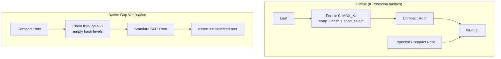

# Variable-Length Sparse Merkle Path

## Problem

The current circuit always iterates over all N levels of the tree (const generic `N`), doing N Poseidon hashes (~65 rows each). For sparse trees (e.g., 134M items in a 2^160 tree), only K ~ 27 levels have non-zero siblings; the rest use precomputed `empty_hash[level]` values. The circuit wastes ~133 Poseidon hashes on levels that could be skipped.

## Approach

- **Circuit**: A new `SparsePathChip<..., MAX_K>` iterates MAX_K times instead of N. Each iteration: `swap + poseidon_hash + conditional_select`. Active slots (non-zero sibling) use the hash result; inactive slots (padding) pass through the previous hash unchanged via conditional select.
- **Native**: A new `SparsePath` stores only the K non-zero sibling entries. It provides both `calculate_compact_root()` (K hashes, matching the circuit) and `calculate_full_root()` (all N levels, matching the standard SMT root).
- **Gap verification**: Done natively outside the circuit. The caller verifies that the compact root (circuit output) chains through empty-hash gap levels to produce the standard SMT root.




## Row Count Comparison (N=160, K=27, MAX_K=32)

- **Current**: N * ~65 = 160 * 65 = **10,400 rows**
- **Variable-length**: MAX_K * ~~67 = 32 * 67 = **~~2,144 rows** (swap + hash + cond_select per slot)
- **Reduction**: ~79%

## File Changes

### 1. Native: [smt/src/smt.rs](smt/src/smt.rs)

Add new types alongside the existing `Path`:

```rust
/// A single non-zero sibling entry in a sparse path.
pub struct SparsePathEntry<F: PrimeField> {
    pub sibling: F,
    pub direction_bit: bool,
    pub level: usize,
}

/// Variable-length Merkle path containing only non-zero siblings.
pub struct SparsePath<F: PrimeField, H: FieldHasher<F, 2>> {
    pub entries: Vec<SparsePathEntry<F>>,
    pub tree_height: usize,
    pub empty_hashes: Vec<F>,
    pub marker: PhantomData<H>,
}
```

Key methods:

- `**SparseMerkleTree::generate_sparse_membership_proof(index)**` -- Walk from leaf to root. At each level, compare sibling to `self.empty_hashes[level]`. Only include levels where they differ. Store the empty_hashes in the SparsePath for gap verification.
- `**SparsePath::calculate_compact_root(leaf, hasher)**` -- Hash through only the K non-zero entries. This must match exactly what the circuit computes.
- `**SparsePath::calculate_full_root(leaf, hasher, leaf_index)**` -- Hash through all `tree_height` levels, using `empty_hashes[level]` for gap levels. Returns the standard SMT root.
- `**SparsePath::to_padded_arrays<MAX_K>()**` -- Convert to fixed-size arrays for the circuit: `[F; MAX_K]` siblings, direction_bits, and is_active flags, padded with zeros for inactive slots.

### 2. Circuit: [chiplet/src/smt_chip.rs](chiplet/src/smt_chip.rs)

Add new structs below the existing `PathChip` (keep the original for backward compatibility):

`**SparsePathConfig<F, S, WIDTH, RATE, MAX_K>**`:

- `s_path: Selector`
- `advices: [Column<Advice>; MAX_K]` -- for siblings, direction_bits, is_active
- `poseidon_config: PoseidonConfig`
- `swap_config: ConditionalSwapConfig`
- `cond_select_config: ConditionalSelectConfig`
- `is_eq_config: IsEqualConfig`

`**SparsePathChip<F, S, H, WIDTH, RATE, MAX_K>**`:

- `siblings: [AssignedCell<F, F>; MAX_K]`
- `direction_bits: [AssignedCell<F, F>; MAX_K]`
- `is_active: [AssignedCell<F, F>; MAX_K]`
- Chip instances for poseidon, swap, conditional_select, is_eq

`**configure(meta)**`: Allocate MAX_K advice columns + utility chip columns. The `ConditionalSelectChip` reuses the first 4 of the 5 swap columns (same pattern as `IsEqualChip` in the current code -- gates are selector-gated so they don't conflict).

`**from_native(config, layouter, sparse_path)**`: 

- Call `sparse_path.to_padded_arrays::<MAX_K>()`
- Assign siblings to row 0, direction_bits to row 1, is_active to row 2 of the `advices` columns

`**calculate_root(layouter, leaf)**`:

```rust
let mut prev = leaf;
for i in 0..MAX_K {
    // Step 1: Swap based on direction bit (1 row)
    let (left, right) = self.swap_chip.swap(
        layouter, prev.clone(), self.siblings[i].clone(),
        self.direction_bits[i].clone(),
    )?;
    // Step 2: Poseidon hash (~64 rows)
    let hash_result = self.poseidon_chip.hash(layouter, &[left, right])?;
    // Step 3: Conditional select -- active: use hash, inactive: pass through (1 row)
    prev = self.cond_select_chip.conditional_select(
        layouter, hash_result, prev, self.is_active[i].clone(),
    )?;
}
Ok(prev)
```

The `conditional_select` constraint includes `cond * (1 - cond) = 0`, which enforces `is_active` is boolean. No additional boolean gate needed.

`**check_membership(layouter, compact_root, leaf)**`: Calls `calculate_root` then `is_eq_chip.is_eq_with_output` against the expected compact root.

### 3. Circuit utilities: [chiplet/src/utilities.rs](chiplet/src/utilities.rs)

The existing `ConditionalSelectChip` already has the right interface -- its `conditional_select(layouter, a, b, cond)` returns `a` when `cond=1`, `b` when `cond=0`. No changes needed.

### 4. Tests

**Native tests** in `smt/src/smt.rs`:

- `test_sparse_proof_generation` -- generate sparse proof, verify K < N
- `test_compact_root_matches` -- compact root matches direct K-hash chain
- `test_full_root_matches_standard` -- `calculate_full_root` on SparsePath equals `smt.root()`
- `test_sparse_roundtrip` -- sparse proof + gap verification = standard membership proof

**Circuit tests** in `chiplet/src/smt_chip.rs`:

- `test_sparse_path_circuit` -- MockProver with small tree (HEIGHT=10, MAX_K=4), verify OK
- `test_sparse_path_full_prove` -- Full keygen + prove + verify cycle
- `test_sparse_vs_dense_consistency` -- Both PathChip and SparsePathChip produce consistent results for the same tree

## Important Design Notes

- **The `PathChip` (dense, N levels) is kept unchanged** for backward compatibility and for use cases where N is small.
- **The compact root differs from the standard SMT root**. The test/application must compute the compact root natively and pass it as the expected root to the circuit. Gap verification (linking compact root to standard root) is done natively.
- **MAX_K is a const generic** because Halo2 circuit shape must be fixed at setup time. Choose MAX_K as a comfortable upper bound for the expected sparsity (e.g., 32 or 40 for trees with up to ~2^32 items).
- **Inactive slots still consume circuit rows** (Poseidon hashes with dummy inputs), but the results are discarded via conditional select. This is unavoidable in PLONKish circuits where the shape is fixed.

